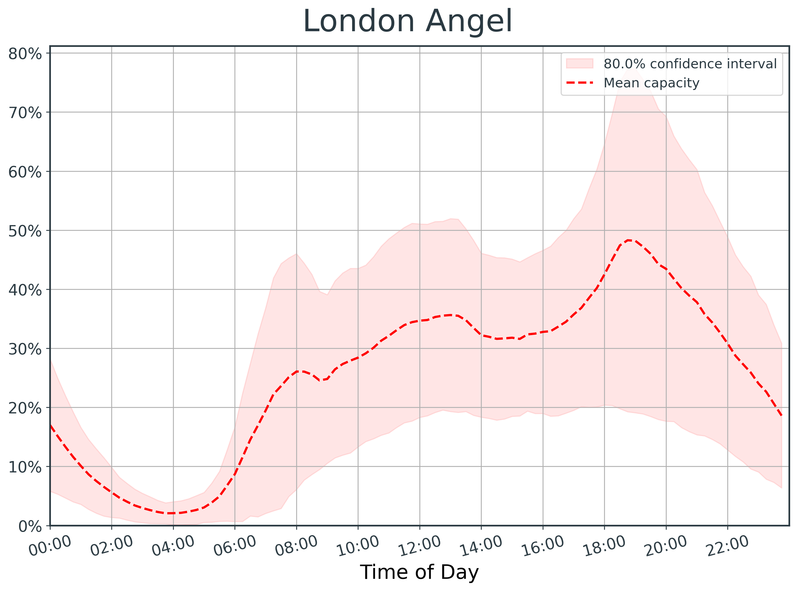
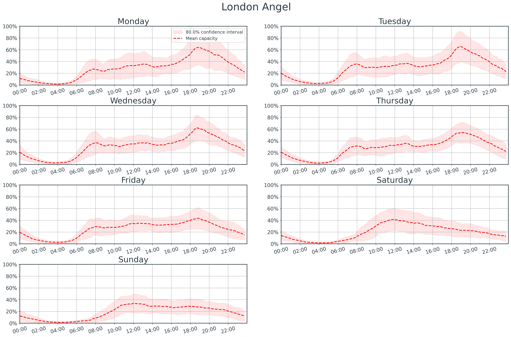

# Gym Forecasting (WIP)

Forecasting how busy my local gym will be using Prophet

## Install

<pre>
pip install -e .
</pre>

## Fetching gym occupancy data

Fetch data from [TheGymGroup](https://www.thegymgroup.com/)'s API through an authenticated session using membership credentials.

```python
from src.data.gym import start_gym_session, get_gym_ids, get_gym_data, save_gym_data

# username should be your TheGym membership email
# password should be your TheGym membership PIN (8-digits as a string, e.g.: "12345678")
sess = start_gym_session(username="your_email@provider.com", password="your_PIN")
```

A comprehensive list of 209 TheGym branchs ids (required for fetching data from TheGym's API) can be loaded.

```python
# retrieve dictionary of branch:id pairs for 209 TheGym branches
gyms = get_gym_ids()
for branch, identifier in gyms.items():
    print(branch, identifier)
```
```
> Altrincham 057d7a7c-a61a-423f-b21f-54adedc1cd0d
> Ashford 5cc9b50b-c049-49d2-a929-b9e9ec34f9ba
> ...205 others...
> Worthing 23becc48-441d-454e-b995-69a88b4853f4
> York Foss Island 942ccf8b-b855-4e9a-928a-99a2513a329a
```

Finally, retrieve and save data for the gym branch of interest

```python
data = get_gym_data(sess, gyms["London Angel"])  # returns data as JSON
save_gym_data(data)  # appends data to `./data/interim/gym.csv`
```

## Visualising gym occupancy data

See the [README notebook](notebooks/20220130-AC-README_examples.ipynb) for `src.visualisation.plotting` examples.

<p align="center">
  
</p>

<p align="center">
  
</p>

## Forecasting gym busyness (WIP)

[Prophet - Simple example with weekdays and weekends/bank holidays.](notebooks/20220320-AC-Prophet_forecasting-weekdays_weekends_bankholidays.ipynb)